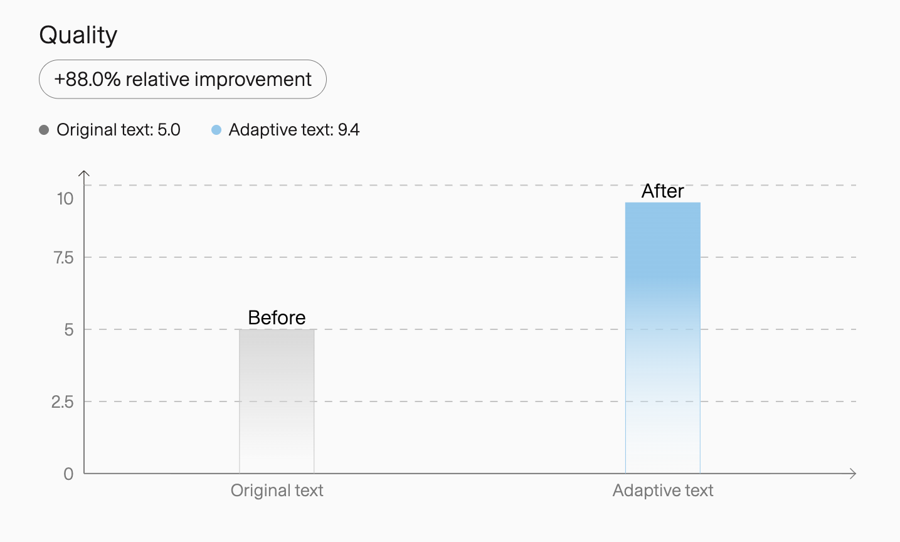
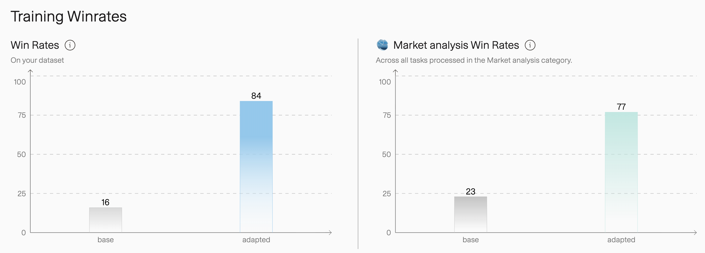
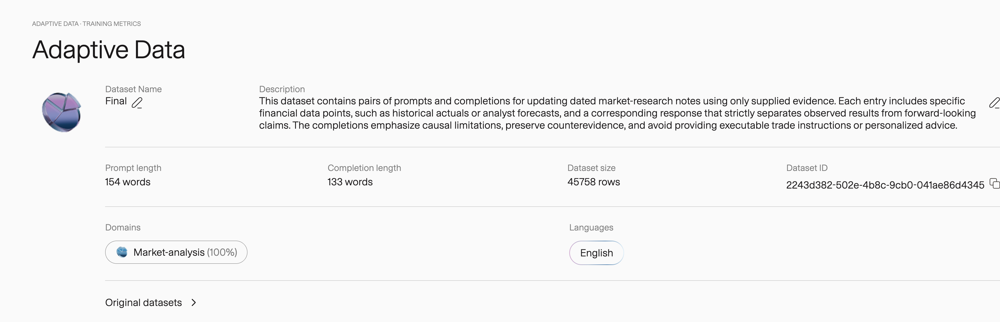
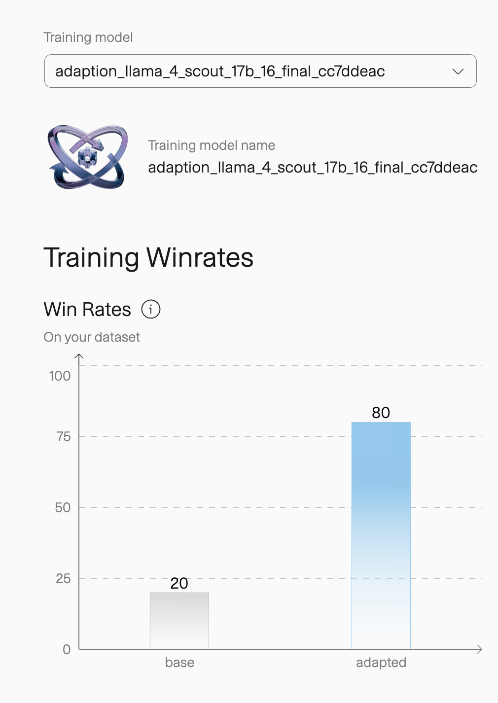

# Experiment History

This record covers all three AutoScientist experiments documented by the public report.

Every score below is a platform-reported pairwise preference rate: the share of comparisons in which a judge preferred the adapted model's response over the base model's response. It is not an accuracy or investment-performance score.

## Attempt #1 — Proof of Concept

### Data

The project began with roughly 1,500 institutional sell-side reports. An answer-first extraction workflow identified analyst judgments, removed judgment leakage from the supplied evidence, ranked the remaining evidence, and derived only the analytical task supported by the source.

The curated baseline contained 739 rows:

| Split | Rows |
| --- | ---: |
| Train | 589 |
| Validation | 77 |
| Held out | 73 |

Adaptive Data expanded the 589-row training split to 27,862 rows, of which 27,405 were reported as used for training. Platform quality increased from 5.0 to 9.4, moving from grade C to grade A.

### Model

| Field | Value |
| --- | --- |
| Base model | `meta-llama/Llama-3.3-70B-Instruct-Reference` |
| Method | LoRA supervised fine-tuning |
| Rank / alpha / dropout | 16 / 32 / 0.05 |
| Target modules | All linear layers |
| Epochs | 2 |
| Learning rate | `1e-4` |
| Training experiment | `22ed78c2-6708-4e15-814f-b2bc73ca95af` |
| Fine-tune job | `140dbd16-fb1d-41da-ac02-b307e8d43024` |

### Results

| Evaluation | Base | Adapted |
| --- | ---: | ---: |
| On-dataset preference | 16% | **84%** |
| Market Analysis preference | 23% | **77%** |

The broader Market Analysis evaluation provided evidence of transfer beyond the experiment's own rows, but it did not establish accuracy or real-world performance.

### Public releases

- Dataset: [Hugging Face](https://huggingface.co/datasets/huyxdang/adaption-equity-analysis-small) · [Kaggle](https://www.kaggle.com/datasets/huydang03/adaption-equity-analysis-small)
- Adapter: [Hugging Face](https://huggingface.co/huyxdang/adaption_vietnam_equity_research_note) · [Kaggle](https://www.kaggle.com/models/huydang03/adaption-vietnam-equity-research-note/PyTorch/lora)

## Attempt #2 — Scaling 50x

### Data

The source corpus expanded from roughly 1,500 to about 7,000 institutional reports, adding macro outlooks, sector studies, fund reviews, and fixed-income commentary. The task taxonomy added market-state interpretation, actual-versus-forward-looking separation, driver transmission, comparative analysis, fund and benchmark analysis, and explicit insufficient-evidence tasks.

Adaptive Data ran three recipes over the same source corpus, then combined their outputs:

| Generation | Rows | Recipe | Quality |
| --- | ---: | --- | --- |
| Dataset 1 | 15,252 | Completion rewritten | 7.0 to 9.2 |
| Dataset 2 | 15,253 | Prompt and completion with response constraints | 7.0 to 9.5 |
| Dataset 3 | 15,197 | Independent variant of the constrained recipe | 7.0 to 9.5 |
| Combined | **45,758** | 45,702 generated rows plus 56 | 8.0 to 9.4 |

The generations share the same underlying source items. The combined row count represents multiple enhancement variants, not 45,758 independent source records.

### Model

| Field | Value |
| --- | --- |
| Base model | `togethercomputer/Llama-4-Scout-17B-16E-Instruct_bnb_4bit` |
| Method | LoRA supervised fine-tuning |
| Rank / alpha / dropout | 32 / 64 / 0.05 |
| Target modules | `q_proj`, `k_proj`, `v_proj`, `o_proj` |
| Epochs / steps | 2 / 168 |
| Peak learning rate | `2e-5` |
| Run ID | `adaption_llama_4_scout_17b_16_final_cc7ddeac` |

### Results

| Evaluation | Base | Adapted |
| --- | ---: | ---: |
| On-dataset preference | 20% | **80%** |
| Market Analysis preference | Not produced | Not produced |

Attempt #2 demonstrated that the data and training workflow could scale while retaining a large preference margin on its own distribution. Without a category-level result, it did not establish broader transfer.

### Public releases

- Dataset: [Hugging Face](https://huggingface.co/datasets/huyxdang/adaption-market-analysis-final) · [Kaggle](https://www.kaggle.com/datasets/huydang03/adaption-market-analysis-final)
- Adapter: [Hugging Face](https://huggingface.co/huyxdang/adaption-market-analysis-final-model) · [Kaggle](https://www.kaggle.com/models/huydang03/adaption-market-analysis-final-model/PyTorch/lora)

## Attempt #3 — AdaptMarket

AdaptMarket changed the base model and moved from LoRA to full-model supervised fine-tuning.

| Field | Value |
| --- | --- |
| Date | 30 July 2026 |
| Track | Market Analysis & News — Equity Analysis |
| Base model | `mistralai/Mixtral-8x7B-Instruct-v0.1` |
| Method | Full-model supervised fine-tuning |
| Data format | Chat |
| Epochs | 1 |
| Learning rate | `0.00001` |
| LoRA | Disabled |
| Training experiment | `e7becda4-f659-4704-b2f8-67f76a029e52` |
| Fine-tune job | `5b1fe1bb-c695-4bfd-bb05-eb24335634e0` |

| Evaluation | Base | AdaptMarket | Change |
| --- | ---: | ---: | ---: |
| On-dataset preference | 15% | **85%** | **+70 percentage points** |
| Market Analysis preference | 27% | **73%** | **+46 percentage points** |

The current experiment's data, model weights, prompts, and per-example evaluation outputs remain restricted. No cleared Attempt #3 result image is available.

## Reading progress across experiments

| Question | Evidence |
| --- | --- |
| Can a small evidence-grounded workflow transfer beyond its own rows? | Attempt #1 recorded a 77-to-23 Market Analysis preference result. |
| Can the data workflow scale materially? | Attempt #2 reached 45,758 generated rows and an 80-to-20 on-dataset result. |
| Can full fine-tuning retain target behavior and improve the broader evaluation? | AdaptMarket recorded 85-to-15 on-dataset and 73-to-27 Market Analysis results. |

The scores must not be ranked as though they came from one controlled benchmark. The models, datasets, methods, and evaluation scopes changed between experiments.
